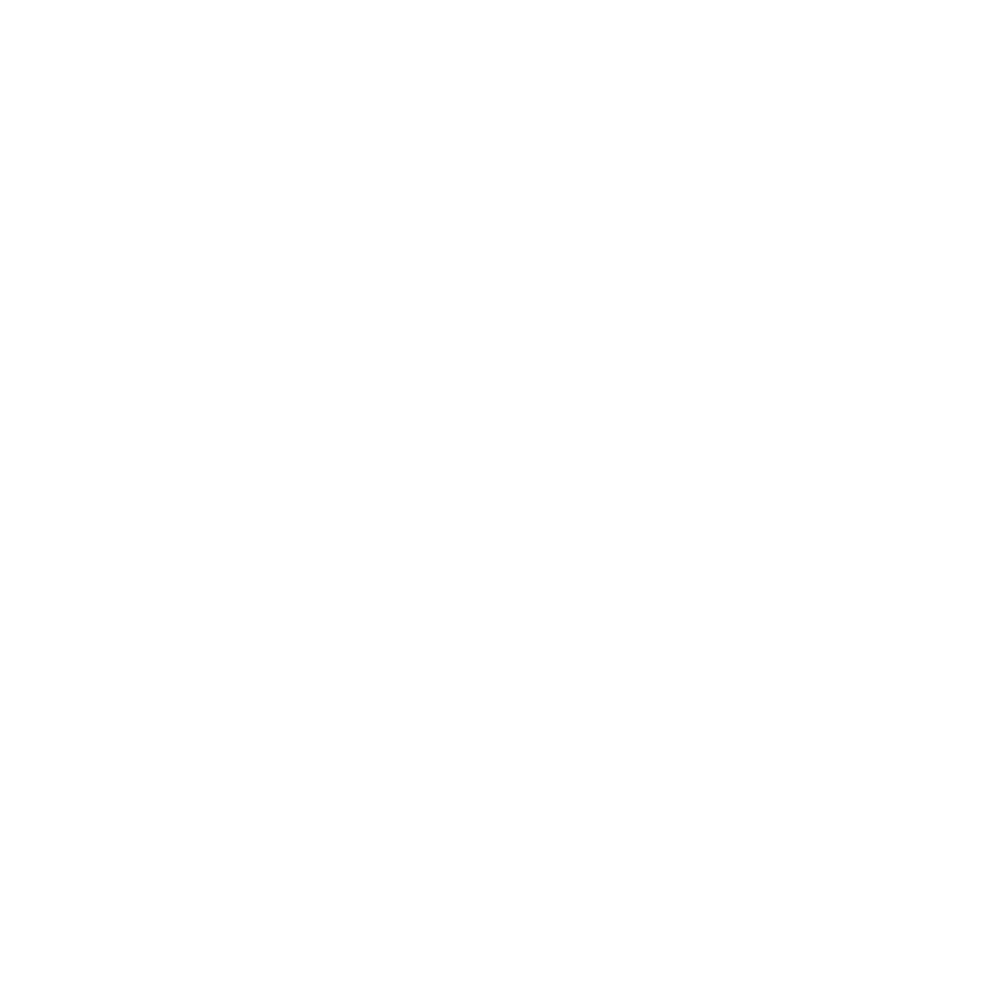
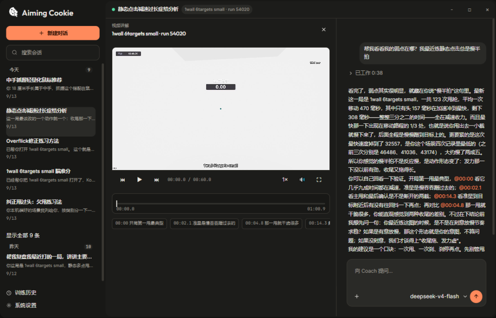

<div align="center">



# Aiming Cookie

**A locally-run AI aim coach for FPS players**

[](LICENSE)
[](https://aimingcookie.com)
[](#quick-start)
[](https://aimingcookie.com)
[](docs/DEVELOPMENT.md)

[简体中文](README.md) · **English**

<picture>
  <source media="(prefers-color-scheme: dark)" srcset="design/opendesign-landing/hero-shot-dark.png">
  <source media="(prefers-color-scheme: light)" srcset="design/opendesign-landing/hero-shot-light.png">
  
</picture>

| ⬇️ [Download](https://aimingcookie.com) | 🚀 [Quick start](#quick-start) | 📚 [Developer docs](docs/DEVELOPMENT.md) | 🧩 [Knowledge Pack SDK](sdk/knowledge-pack/SPEC.en.md) |
| :---: | :---: | :---: | :---: |

</div>

---

Built for serious KovaaK's FPS Aim Trainer players: by the time you finish a run, it has already reviewed your mouse trajectory, match telemetry, kill log, and screen recording — and can tell you what went wrong, by how many degrees, and what to practice next.

No scores, no vibes — every piece of evidence comes from your own machine, and analysis and data stay local.

## 🆕 Knowledge Pack SDK is open (2026-09-20)

The Coach's aiming knowledge is no longer limited to the official set. We turned the whole knowledge system into a **replaceable, open format**: if aiming is your expertise — coach, content creator, hardcore player — you can package your knowledge as a **knowledge pack**, import it into Aiming Cookie, and **replace the official library wholesale**. What the Coach teaches and which drills it recommends then follow your system; the official library remains the built-in default — switch back with one click, broken packs roll back automatically, and analysis is never affected.

- Build your own knowledge base: start with the [Knowledge Pack SDK spec](sdk/knowledge-pack/SPEC.en.md) ([中文](sdk/knowledge-pack/SPEC.md)); adapt the [template pack](sdk/knowledge-pack/template/) and it is ready to import
- Data reference — what AC captures, where it comes from, and what it reflects, documented category by category (the prerequisite for writing "data → symptom" mapping rules): [English](sdk/knowledge-pack/docs/data-reference.en.md) / [中文](sdk/knowledge-pack/docs/data-reference.md)
- The official diagnostic rules ship in the same format (`knowledge/mapping/`) — the best reference sample; a validator CLI is included in the repository

---

## Why this exists

Aiming tools on the market come in two kinds: **stat dashboards** (they give you KPS and hit rate, but never the why) and **vibe coaching** (it can explain why, but it never sees your data).

Aiming Cookie's position: **a coach must look at the evidence before it speaks.** Each training run is decomposed into four evidence streams; a deterministic pipeline measures them, a vision pipeline "watches" the targets, and an LLM coach teaches from those facts — every judgment traces back to specific data, and what the data cannot support is simply not claimed.

## How it works

```
You play a KovaaK's scenario
      │  (fully automatic, zero interaction)
      ▼
┌─────────────────────────────────────────┐
│  Multi-source evidence capture          │
│  Match telemetry · Stats kill feed ·    │
│  Performance counters · Raw Input trace │
│  · screen recording                     │
└─────────────────────────────────────────┘
      ▼
┌─────────────────────────────────────────┐
│  Deterministic analysis + generic CV    │
│  Kinematic metrics · target detection · │
│  hit detection · offset vectors ·       │
│  switching cadence · tracking error     │
└─────────────────────────────────────────┘
      ▼
┌─────────────────────────────────────────┐
│  AI Coach walkthrough                   │
│  reads real data → points out issues →  │
│  @ video moments → training advice →    │
│  tracks your progress                   │
└─────────────────────────────────────────┘
```

## Core capabilities

### 🎯 Millisecond telemetry — the core differentiator

Score panels tell you "how it went"; telemetry answers "what actually happened on screen and in your hand":

- **Fully automatic capture**: KovaaK's stats kill feed, score counters, match telemetry, and window recordings are ingested automatically as you play; source files are fingerprinted, so a single modified byte gets caught
- **Complete ground truth for every target**: when each target appeared, where, how it moved, how big it was, when it was destroyed — all from the game's own data, never estimated from pixels; target sizes come straight from the scenario definition
- **Windows Raw Input** (opt-in authorization): true OS-level mouse signal at 1 ms sampling — not an in-game interpolated approximation
- **Metrics computed from ground truth**: per-shot hit/miss, angular error at the kill moment, tracking-error curves, target-switching time — all derived from target ground truth plus raw input; hit calling treats telemetry as authoritative, and angular measurements reach sub-degree precision
- **One shared millisecond timeline**: all evidence is mutually aligned, so every second the Coach points at matches the video

### 👁️ Generic vision analysis — target-seeing fallback and supplement

For runs where telemetry is unavailable (old saves, special scenarios), the vision pipeline rebuilds evidence independently from the recording:

- **All-scenario coverage**: static clicking (flicking / target punching), dynamic clicking (moving targets), switching, and tracking — any map, no pre-configuration
- **Zero training, zero model files**: built on a closed three-shape prior (KovaaK's targets are only spheres, vertical capsules, or humanoids) plus color hypothesis sets that discover target colors automatically; pure classic CV, deterministic and reproducible
- **Behavioral detail**: crosshair-correction shapes, switching trajectories, and other pixel-level evidence, cross-checkable against telemetry
- **Honest degradation**: every run carries quality gates (target-color confidence, kill-pairing rate, coverage); runs it cannot read (e.g. firework-particle scenarios) never produce made-up visual conclusions

### 🧠 Evidence-driven AI Coach

Connect your own LLM provider (OpenAI-compatible protocol), or use the Aiming Cookie hosted service (beta), and:

- **Teaching grounded in facts**: the Coach reads analysis evidence through controlled tools (metrics, events, distributions) instead of guessing; coaching terminology follows a community-reviewed glossary (flick / settle / target switching), applied consistently
- **@-tagged video replay**: when it says "watch your correction in these 3 seconds", click the @ marker to jump straight to that moment in the recording
- **Training loop**: training plans generated from diagnoses → completion tracking → retest comparisons
- **Scenario deep-links**: search KovaaK's official library (170,000+ scenarios) in one click; a recommended scenario launches straight into KovaaK's after your confirmation
- **Local knowledge base**: built-in aiming theory, KovaaK's data interpretation, and gear (mouse / mousepad) selection knowledge in structured form; the Coach must consult the library before teaching, and says so when it cannot find an answer
- **Long-term view**: cross-run trends and history comparisons are the Coach's job — you never have to dig through old records

### 🔒 Local-first privacy

- Single-user desktop app: runs, analyses, conversations, and knowledge all stay on your machine as human-readable, backable-up JSON files (`%APPDATA%`)
- Only two kinds of automatic network activity exist: version-update checks and KovaaK's version-offset table fetches — neither touches your training data
- Everything else is your call: model traffic goes only to the provider you configured (or the hosted service during the beta); diagnostic bundles are sent only when you manually click "Upload"

## Interface tour

Three everyday surfaces, no dashboard clutter:

- **Coach**: the conversation, your current training plan, and the run mounted into "this discussion" (click to open its recording)
- **History**: per-run timeline, analysis status, and video playback
- **Analysis workspace**: diagnosis / video player / data view in three columns, drill down from any metric

## Current status

**v1.3.2 released** (the installer and auto-updates are distributed via the official website; the installer is unsigned — SmartScreen will ask you to choose "Run anyway").

- ✅ Four-source capture, generic vision analysis, full Coach capabilities, auto-update — all verified on real machines
- 🚧 Known limitations: analyses that include video take 1–2 minutes (with a progress display); hit detection has a ±10 px visual gray zone; the installer is unsigned
- 📋 Detailed status and blockers: [`docs/PROGRESS.md`](docs/PROGRESS.md) (Chinese)

## Quick start

**Everyday users**: download the installer from [aimingcookie.com](https://aimingcookie.com) → install → configure an LLM provider in Settings → authorize Raw Input and window capture → open KovaaK's and play.

**Running from source / development**: see [`docs/DEVELOPMENT.md`](docs/DEVELOPMENT.md) (Chinese) for the three-process startup, test commands, and Tauri packaging.

## Tech stack

| Layer | Tech | Notes |
|---|---|---|
| Desktop shell | Tauri (Rust) | Window capture, Raw Input, local tokens, subprocess orchestration |
| Backend | Python FastAPI | Analysis task queue, KovaaK's ingestion, deterministic analysis pipeline |
| Coach runtime | Bun/Node sidecar | LLM conversation orchestration, controlled tools, JSONL session persistence |
| Vision | OpenCV classic CV | Three-shape classification + color hypothesis sets, no neural networks |
| Frontend | Next.js | Coach / History / analysis workspace |
| Data | Local JSON files | No database; human-readable and backable up |

Data contracts are governed as "frozen contracts": key schemas are explicitly versioned (`*.v1`), and upgrades must go through version evolution rather than silent rewrites.

## Repository layout

| Path | Responsibility |
|---|---|
| `kovaak_tracker/` | Deterministic analysis and vision domain logic (kinematics, CV, evidence contracts) |
| `telemetry_capture/` | Match telemetry capture and KovaaK's version adaptation |
| `webapp/backend/` | FastAPI, task queue, KovaaK's ingestion, Coach orchestration |
| `webapp/coach-runtime/` | Node Coach sidecar (conversation, tools, knowledge base) |
| `webapp/frontend/` | Next.js frontend and the Tauri desktop shell |
| `third_party/pi/` | The Pi runtime source baseline maintained by this project |
| `design/` | Official landing page and historical design drafts |
| `scripts/` | Build, packaging, and e2e helper scripts |
| `docs/` | Product, architecture, roadmap, progress, and historical material |
| `tests/`, `webapp/tests/` | Core and web/desktop regression tests |

## Documentation

Most project documents are written in Chinese:

- Product goals & scope: [`docs/PRD.md`](docs/PRD.md)
- System boundaries & data contracts: [`docs/ARCHITECTURE.md`](docs/ARCHITECTURE.md)
- Install, startup, testing: [`docs/DEVELOPMENT.md`](docs/DEVELOPMENT.md)
- Delivery order: [`docs/ROADMAP.md`](docs/ROADMAP.md) · Current snapshot: [`docs/PROGRESS.md`](docs/PROGRESS.md)
- Documentation index: [`docs/README.md`](docs/README.md)

## License

This project is open-sourced under [GPL-3.0-or-later](LICENSE). Third-party attributions are listed in [NOTICE](NOTICE):

- [RefleK's](https://github.com/ARm8-2/refleks) (GPL-3.0): the field mapping in the KovaaK's `.perf` score parser is adapted from its implementation — see [`kovaak_tracker/performance_parser.py`](kovaak_tracker/performance_parser.py)
- [pi (Pi Agent Harness)](https://pi.dev) (MIT): vendored at [`third_party/pi/`](third_party/pi/)

This is an independent personal project with no affiliation to KovaaK's / FPS Aim Trainer, Steam, or Valve.

---

*The capabilities described in this README reflect the current code, tests, and real-machine results.*
